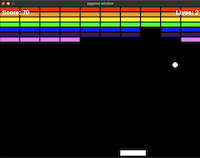
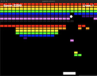

# Brick Addition

Welcome to Brick Addition, a twist on the classic Breakout game. This game comes in two versions: a version developed entirely by ChatGPT, `brick_breaker.py`, and a human-enhanced version, `brick_addiction.py`, which combines the creativity of human developers with the capabilities of ChatGPT for code enhancements. As players progress through the game, they'll face an increasing number of bricks and accelerating ball speed, culminating in a challenging race to clear 18 rows of bricks to win the game.

## Versions

- **Brick Breaker (ChatGPT-generated Version)**: Developed entirely by ChatGPT using the [iterative coding GPT](https://chat.openai.com/g/g-ZfQ1k76Cv-iterative-coding), this version offers a pure AI-crafted experience.

<figure>
  
  <figcaption>Brick Breaker</figcaption>
</figure>

- **Brick Addiction (Human-Enhanced Version)**: This version starts with the foundation laid by ChatGPT and incorporates human creativity for further enhancements. Please note, while contributions are welcome for both versions, enhancements to `brick_addiction.py` can only be written by ChatGPT, based on your suggestions and ideas.

<figure>
  
  <figcaption>Brick Addiction</figcaption>
</figure>

## Features

- **Dynamic Gameplay**: Experience the thrill of navigating through increasing numbers of bricks.
- **Increasing Difficulty**: The game intensifies as the speed of the ball increases with each cleared row.
- **Victory Conditions**: Aim to clear 18 rows of bricks to emerge victorious.
- **Simple Controls**: The game is designed with easy-to-learn controls for an immersive experience.

## How to Play

1. **Move the Paddle**: Use the arrow keys (← →) to maneuver the paddle left and right.
2. **Break Bricks**: Ricochet the ball with your paddle to pulverize the bricks.
3. **Avoid Losing the Ball**: Keep the ball in play to avoid losing lives.
4. **Win the Game**: Successfully clear all 18 rows of bricks to claim victory.

## Installation

Both versions of Brick Addition are built using Python and Pygame. Follow these steps to get started:

1. **Install Python**: Ensure Python is installed on your system. If not, download it from [python.org](https://www.python.org/).
2. **Install Pygame**: Execute `pip install pygame` in your terminal to install Pygame.
3. **Download the Game**: Clone this repository or download the game files directly.
4. **Run the Game**: Navigate to the game directory and execute `python brick_breaker_game.py` or `python brick_addiction.py` to launch the respective version.

## Contributing

Your contributions to Brick Addition are highly appreciated! You can contribute to either version of the game. For those interested in enhancing `brick_breaker.py`, please note that while your ideas and suggestions are appreciated, the code enhancements for this version need to be entirely implemented by ChatGPT to maintain the unique collaboration between humans and AI's.

## License

Brick Addition is released under the MIT license. See the  [LICENSE](LICENSE.md) file for more information.

## Acknowledgments

- A heartfelt thank you to all contributors and players who bring this game to life.
- Inspired by the classic Breakout, Brick Addition seeks to offer a modern and challenging twist on the beloved game.

We hope you enjoy playing Brick Addition and pushing the boundaries of what you can achieve!
